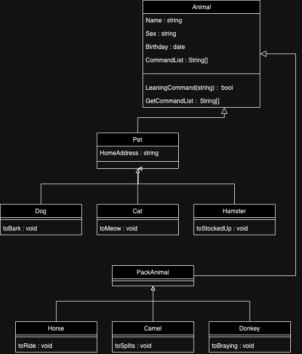

### Задание

1. Используя команду cat в терминале операционной системы Linux, создать
два файла Домашние животные (заполнив файл собаками, кошками,
хомяками) и Вьючные животными заполнив файл Лошадьми, верблюдами и
ослы), а затем объединить их. Просмотреть содержимое созданного файла.
Переименовать файл, дав ему новое имя (Друзья человека).
```
cat >> pets 
cat >> animals
cat pets animals >> join
cat join
mv join 'Друзья человека'
```
2. Создать директорию, переместить файл туда.
```
mkdir test
mv 'Друзья человека' test/
```
3. Подключить дополнительный репозиторий MySQL. Установить любой пакет
из этого репозитория.
```
wget -c https://dev.mysql.com/get/mysql-apt-config_0.8.16-1_all.deb
sudo dpkg -i mysql-apt-config_0.8.16-1_all.deb
```
4. Установить и удалить deb-пакет с помощью dpkg.
```
sudo dpkg -i debian-cd
sudo dpkg -P debian-cd
```

5. Выложить историю команд в терминале ubuntu
```
history
```
6. Нарисовать диаграмму, в которой есть класс родительский класс, домашние
животные и вьючные животные, в составы которых в случае домашних
животных войдут классы: собаки, кошки, хомяки, а в класс вьючные животные
войдут: Лошади, верблюды и ослы).


7. В подключенном MySQL репозитории создать базу данных “Друзья человека”
```
create database "Друзья человека";
```
8. Создать таблицы с иерархией из диаграммы в БД
```
CREATE TABLE IF NOT EXISTS parent (
    id SERIAL PRIMARY KEY,
    name varchar(50) unique not null
);

CREATE TABLE IF NOT EXISTS animal (
    id SERIAL PRIMARY KEY,
    type_id int not null,
    command_list integer ARRAY,
    name varchar(50) not null,
    sex  varchar(10) not null,
    birthday date,
    address_id int
);

CREATE TABLE IF NOT EXISTS type (
    id SERIAL PRIMARY KEY,
    parent_id int not null,
    name varchar(50) unique not null
);

CREATE TABLE IF NOT EXISTS command (
    id SERIAL PRIMARY KEY,
    name varchar(50) unique not null
);

CREATE TABLE IF NOT EXISTS address (
    id SERIAL PRIMARY KEY,
    title varchar(250) not null
);

ALTER TABLE animal ADD CONSTRAINT animal_fk_parent_id FOREIGN KEY (address_id) REFERENCES address (id);
ALTER TABLE animal ADD CONSTRAINT animal_fk_type_id FOREIGN KEY (type_id) REFERENCES type (id);
ALTER TABLE type ADD CONSTRAINT type_fk_parent_id FOREIGN KEY (parent_id) REFERENCES parent (id);
```

9. Заполнить низкоуровневые таблицы именами(животных), командами
которые они выполняют и датами рождения

```
INSERT INTO public.address (title) VALUES
    ('Russia'),
    ('Egypt'),
    ('America');

INSERT INTO public.command (name) VALUES
   ('Sit down'),
   ('Stand up'),
   ('To Lie'),
   ('To Stand'),
   ('To Run');

INSERT INTO public.parent (name) VALUES
   ('Pet'),
   ('Pack Animal');

INSERT INTO public.type (parent_id, name) VALUES
    (1,'Cat'),
    (1,'Dog'),
    (1,'Hamster'),
    (2,'Camel'),
    (2,'Horse'),
    (2,'Donkey');

INSERT INTO public.animal (type_id, command_list, name, sex, birthday, address_id) VALUES
    (3,'{1,3,4}','Ruuu','m','2015-04-06',1),
    (1,'{1,2}','Tuuu','m','2016-04-06',1),
    (5,'{1,3}','Zuu','m','2016-04-06',null),
    (2,'{1,5}','Guuuu','w','2017-04-06',2),
    (6,'{1,2,5}','Wuu','w','2016-04-11',null),
    (4,'{3,4}','Nuuu','m','2024-01-06',null),
    (3,'{1,3,4}','Wwww','m','2024-04-01',1),
    (1,'{1,2}','Aaaaa','m','2024-03-11',1),
    (5,'{1,3}','Sssss','m','2021-02-22',null),
    (2,'{1,5}','Zzzzz','w','2024-01-23',2),
    (6,'{1,2,5}','Rrrr','w','2023-03-11',null),
    (4,'{3,4}','Iiii','m','2022-01-06',null);
```

10. Удалив из таблицы верблюдов, т.к. верблюдов решили перевезти в другой
питомник на зимовку. Объединить таблицы лошади, и ослы в одну таблицу.

```
delete  from animal a
    where a.type_id IN (SELECT id FROM public.type where lower(name) = 'camel');

insert into public.type (parent_id, name) VALUES
    (2,'Horse and Donkey');

update animal set type_id = (select id from public.type where name = 'Horse and Donkey')
    where type_id in (select id from public.type where lower(name) in ('horse','donkey'));
```

11. Создать новую таблицу “молодые животные” в которую попадут все
животные старше 1 года, но младше 3 лет и в отдельном столбце с точностью
до месяца подсчитать возраст животных в новой таблице
```
CREATE TABLE IF NOT EXISTS "молодые животные" (
    id SERIAL PRIMARY KEY,
    type_id int not null,
    command_list integer ARRAY,
    name varchar(50) not null,
    sex  varchar(10) not null,
    birthday date,
    address_id int,
    age_in_month int
);


ALTER TABLE "молодые животные" ADD CONSTRAINT new_fk_parent_id FOREIGN KEY (address_id) REFERENCES address (id);
ALTER TABLE "молодые животные" ADD CONSTRAINT new_fk_type_id FOREIGN KEY (type_id) REFERENCES type (id);


CREATE OR REPLACE FUNCTION update_age_in_month()
RETURNS trigger AS $$
BEGIN
    NEW.age_in_month := (DATE_PART('YEAR', now()) -
DATE_PART('YEAR', new.birthday)) * 12 + (DATE_PART('Month', now()) -DATE_PART('Month', new.birthday));
  RETURN NEW;
END;
$$ LANGUAGE plpgsql;

CREATE TRIGGER update_age_in_month_trigger
    BEFORE INSERT ON "молодые животные"
    FOR EACH ROW
    EXECUTE PROCEDURE update_age_in_month();

INSERT INTO "молодые животные" (id, type_id, command_list,name,sex,birthday,address_id)
SELECT *
FROM animal
where (DATE_PART('YEAR', now()) -
DATE_PART('YEAR', birthday)) * 12 + (DATE_PART('Month', now()) -DATE_PART('Month', birthday)) between 1 and 36;

```
12. Объединить все таблицы в одну, при этом сохраняя поля, указывающие на
прошлую принадлежность к старым таблицам.
```
select a.id,p.name,t.name,array_to_string(array_agg(c.name), ', ') command_list,a.name,a.sex,a.birthday,ad.title
    from animal a
    left join public.address ad on ad.id = a.address_id
    left join public.type t on t.id = a.type_id
    left join public.parent p on p.id = t.parent_id
    left join public.command c on c.id = any (a.command_list)
    group by a.id,p.name,t.name,ad.title
```

13. Создать класс с Инкапсуляцией методов и наследованием по диаграмме.

 [AnimalStruct](https://github.com/lewa100/java_final_curs/tree/new_struct/AnimalStruct)

14. Написать программу, имитирующую работу реестра домашних животных.
В программе должен быть реализован следующий функционал:
14.1 Завести новое животное
14.2 определять животное в правильный класс
14.3 увидеть список команд, которое выполняет животное
14.4 обучить животное новым командам
14.5 Реализовать навигацию по меню

 [PetsApp](https://github.com/lewa100/java_final_curs/tree/new_struct/PetsApp)

15. Создайте класс Счетчик, у которого есть метод add(), увеличивающий̆
значение внутренней̆ int переменной̆ на 1 при нажатие “Завести новое
животное” Сделайте так, чтобы с объектом такого типа можно было работать в
блоке try-with-resources. Нужно бросить исключение, если работа с объектом
типа счетчик была не в ресурсном try и/или ресурс остался открыт. Значение
считать в ресурсе try, если при заведения животного заполнены все поля.

 [Counter](https://github.com/lewa100/java_final_curs/blob/new_struct/PetsApp/Domain/Counter.java)